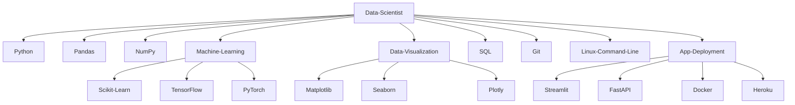

 
<!----------------------------------------------------------------------------------------------------------------------------------->

 
<h2>
  Acerca de mí
</h2>

Científico de datos especializado en la transformación de datos en información estratégica para la toma de decisiones. Cuento con experiencia en **Python**, desarrollo de **scripts** y aplicaciones para optimización de procesos, y en la implementación de modelos predictivos de **Machine Learning** para mejorar la precisión en decisiones basadas en datos.

Domino herramientas de visualización como **Matplotlib** y **Seaborn**, logrando una comunicación efectiva de resultados. Con enfoque en aprendizaje continuo, busco aportar en proyectos innovadores que generen impacto y valor. Estoy abierto a nuevos desafíos que impulsen mi desarrollo profesional.

<!----------------------------------------------------------------------------------------------------------------------------------->

## Encuentrame en:

  
  

<!----------------------------------------------------------------------------------------------------------------------------------->

<h2>
  Mis habilidades
</h2>

   

<!----------------------------------------------------------------------------------------------------------------------------------->

 

 

<!----------------------------------------------------------------------------------------------------------------------------------->
  * ### Lenguajes de programación y librerías:
    
    
    
    
    
    
    
    
    
    
    
    
    

  * ### Bases de datos y servicios en la nube:
    
    
    
    

  * ### Herramientas de desarrollo:
    
    
    
    
    
    

  * ### Terminales:
    
    
    

  * ### Sistemas operativos:
    
    
    
  
  * ### Herramientas de gestión de proyectos:
    
    
    

  * ### Otras tecnologías:
   

     &nbsp;
     &nbsp;
     &nbsp;
     &nbsp;
     &nbsp;
     &nbsp;
     &nbsp;
     &nbsp;
      &nbsp;
      &nbsp;
   

   <!----------------------------------------------------------------------------------------------------------------------------------->

<h2>
  Estadisticas Github

  
  
</h2>

  
   
  

 

  

 

Mis repositorios reflejan una variedad de proyectos relacionados con el análisis de datos y desarrollo de soluciones basadas en Machine Learning. A través de ellos, he implementado soluciones en Python, donde se puede ver el uso de bibliotecas como pandas y scikit-learn, junto con análisis visuales utilizando herramientas como matplotlib y seaborn. Además, algunos de mis proyectos demuestran la integración de bases de datos utilizando MySQL y el manejo eficiente de Git, GitHub. Estos [repositorios](https://github.com/EAndresAcosta?tab=repositories) muestran mi interés en desarrollar soluciones prácticas que optimicen la toma de decisiones basadas en datos.

<!----------------------------------------------------------------------------------------------------------------------------------->

   
<b>Visitors Count 👽 </b>
  
  

 
   

<!----------------------------------------------------------------------------------------------------------------------------------->

